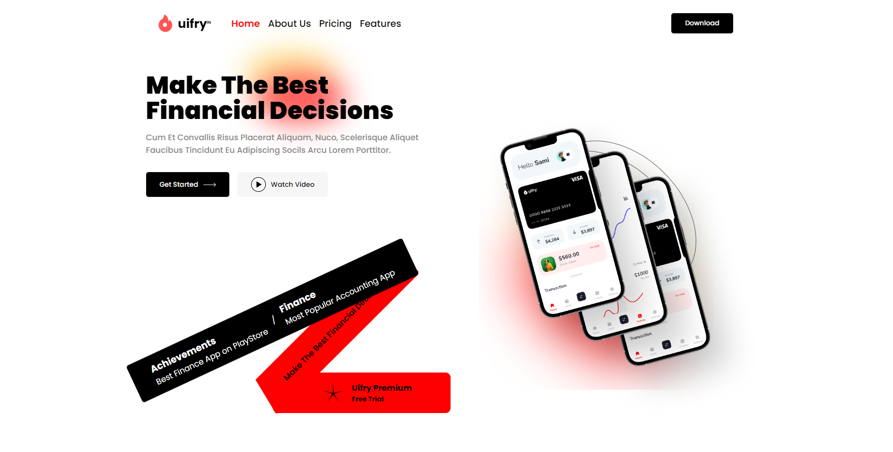

# Uifry

<h2>These are the Images of a Project</h2>

 

<h2>Technologies Used</h2>
<li>HTML</li>
<li>CSS</li>
<li>JavaScript</li>
<li>React</li>
 

<h2>About the Project</h2>

This project is a clone of the homepage design from Uifry, created using Figma. The goal of this project is to replicate the UI design as closely as possible using HTML, CSS, and JavaScript, ReactJs.

<h2>If you want to run this application in your system, Follow the below steps:</h2>
<h3>
<ol type="1">
   
  <li>
    Open a folder in a VS Code and go to the Terminal.
  </li>
   
  <li>
    Run the below command to clone repository
     "git clone https://github.com/moheebk123/Uifry.git"
  </li>
   
  <li>
    Run the below command to change directory
     "cd .\Uifry\"
  </li>
   
  <li>
    Run the below command to install necessary packages  "npm i" or
    "npm install"
  </li>
   
  <li>
    Run the below command to start development server "npm run dev"
  </li>
   
  <li>
    Go to the link provided by vite in terminal.
  </li>
</ol>
